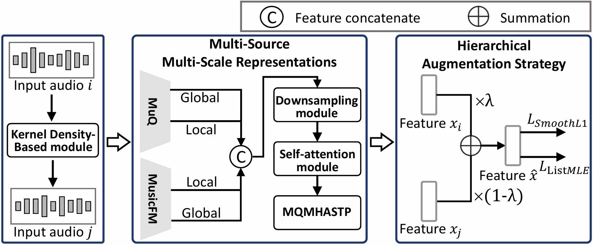

# **HEAR**: Hierarchically Enhanced Aesthetic Representations for Multidimensional Music Evaluation
Official PyTorch Implementation of ICASSP 2026 paper "HEAR: Hierarchically Enhanced Aesthetic Representations for Multidimensional Music Evaluation"

This repository contains the training and evaluation code for HEAR, a robust framework designed to address the challenges of multidimensional music aesthetic evaluation under limited labeled data.

## 🌟 Key Features
* **SOTA Performance**: Ranked 2nd/19 on Track 1 and 5th/17 on Track 2 in the [ICASSP 2026 Automatic Song Aesthetics Evaluation Challenge](https://aslp-lab.github.io/Automatic-Song-Aesthetics-Evaluation-Challenge/).
* **Robustness**: Synergizes Multi-Source Multi-Scale Representations and Hierarchical Augmentation to capture robust features under limited labeled data.
* **Dual Capability**: Optimized for both exact score prediction and ranking (Top-Tier Identification).

## 📦 Installation
Clone the repository and install dependencies:
```
git clone https://github.com:Eps-Acoustic-Revolution-Lab/EAR_HEAR.git
git submodule update --init --recursive

conda create -n hear python=3.10 -y
conda activate hear
pip install -r requirements.txt
```

## 🚀 Quick Start
TODO: Package as a command-line tool

## 🎯 Training

### Step 1: Data Preparation

First, prepare the dataset by running the data pipeline:

```bash
cd data_pipeline
bash run.sh
```

This script will:
1. **Download Dataset**: Download the [SongEval](https://huggingface.co/datasets/ASLP-lab/SongEval) dataset
2. **Split Dataset**: Split the dataset into training and validation sets based on [the challenge's validation IDs
](https://github.com/ASLP-lab/Automatic-Song-Aesthetics-Evaluation-Challenge/blob/main/static/val_ids.txt)
3. **Audio Augmentation**: Apply audio augmentation to the training set
4. **Extract Features**: Extract MuQ and MusicFM features for both training and test sets
5. **Generate PKL Files**: Generate `train_set.pkl` and `test_set.pkl` files for training and evaluation


### Step 2: Model Training

After data preparation, you can train the HEAR model for either Track 1 (single-label: Musicality) or Track 2 (multi-label: 5 dimensions).

#### Track 1: Single-Label Training (Musicality)

Train the model for musicality prediction:

```bash
python train_track_1.py \
    --experiment_name track1_exp \
    --train-data /path/to/train.pkl \
    --test-data /path/to/test.pkl \
    --max-epoch 60 \
    --batch-size 8 \
    --lr 1e-5 \
    --weight_decay 1e-3 \
    --accum_steps 4 \
    --lambda 0.15 \
    --workers 8 \
    --seed 0
```

#### Track 2: Multi-Label Training (5 Dimensions)

Train the model for multi-dimensional aesthetic evaluation:

```bash
python train_track_2.py \
    --experiment_name track2_exp \
    --train-data /path/to/train.pkl \
    --test-data /path/to/test.pkl \
    --max-epoch 60 \
    --batch-size 8 \
    --lr 1e-5 \
    --weight_decay 1e-3 \
    --accum_steps 4 \
    --lambda 0.05 \
    --workers 8 \
    --seed 0
```

#### Key Parameters

* `--max-epoch`: Maximum number of training epochs (default: 60)
* `--batch-size`: Batch size for training (default: 8)
* `--experiment_name`: Name of the experiment for saving models and logs
* `--lr`: Learning rate (default: 1e-5)
* `--weight_decay`: Weight decay for optimizer (default: 1e-3)
* `--accum_steps`: Gradient accumulation steps (default: 4)
* `--lambda`: Weight for ranking loss (Track 1: 0.15, Track 2: 0.05)
* `--workers`: Number of data loading workers (default: 8)
* `--seed`: Random seed for reproducibility (default: 0)
* `--train-data`: Path to training data pkl file (default: `data_pipeline/dataset_pkl/train_set.pkl`)
* `--test-data`: Path to test data pkl file (default: `data_pipeline/dataset_pkl/test_set.pkl`)
* `--log-dir`: Path to tensorboard log directory (default: `./log/tensorboard_records/{experiment_name}`)

#### Evaluation Mode

To evaluate a trained model, use the `--eval` flag:

```bash
python train_track_1.py --eval --experiment_name track1_exp
python train_track_2.py --eval --experiment_name track2_exp
```

#### Model Configuration

Model architectures are configured in:
* `config_track_1.yaml` - Configuration for Track 1
* `config_track_2.yaml` - Configuration for Track 2

Trained models are saved in `log/models/{experiment_name}/model.pth`, and training logs are saved to TensorBoard in `./log/tensorboard_records/{experiment_name}/` (or custom path specified by `--log-dir`).


